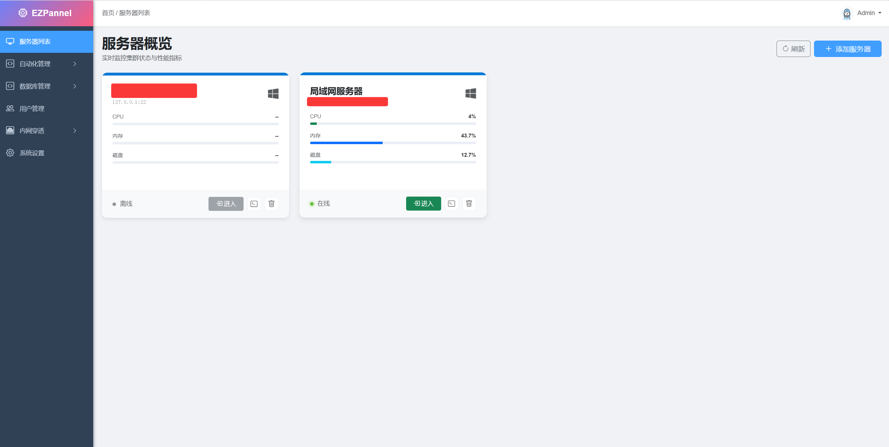
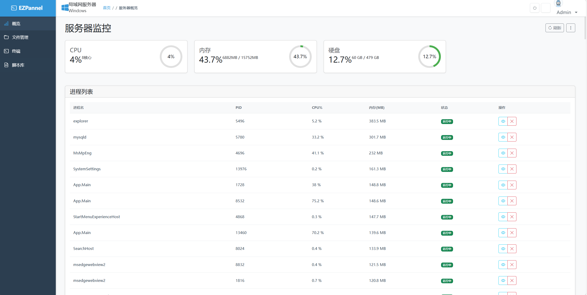

# EZPannel - 轻量级服务器管理面板

## 项目简介

EZPannel是一款基于 ASP.NET Core MVC 的轻量级服务器管理面板，提供全方位的服务器管理功能，支持多平台部署。




## 功能特性

### 核心功能
- ✅ 跨平台支持：Windows/Linux
- ✅ SSH 终端：远程连接服务器终端
- ✅ SFTP 文件管理：可视化文件上传、下载、编辑
- ✅ 脚本自动化执行：批量执行脚本，定时任务
- ✅ 数据库备份/恢复：支持MySQL等数据库
- ✅ 内网穿透代理：将内网服务暴露到公网

### 技术特性
- ✅ 基于 ASP.NET Core MVC 构建
- ✅ 响应式设计，支持移动端访问
- ✅ 模块化架构，易于扩展
- ✅ 安全认证机制
- ✅ 实时监控和日志记录

## 系统要求

- .NET 10.0 或更高版本
- Windows/Linux 操作系统
- Web 服务器（如 IIS、Nginx）

## 安装与使用

### 方法一：直接部署

1. 下载发布包
2. 解压到服务器目录
3. 配置数据库连接
4. 启动应用服务

### 方法二：Docker 部署

```bash
# 构建镜像
docker build -t ezpannel .

# 运行容器
docker run -d -p 80:80 --name ezpannel ezpannel
```

### 初始登录

- 默认地址：`http://your-server-ip:80`
- 默认账号：admin
- 默认密码：admin123

## 功能模块

### 1. 服务器管理
- 服务器状态监控
- 系统资源使用情况
- 进程管理

### 2. 文件管理
- 可视化文件浏览器
- 文件上传/下载
- 文件编辑
- 权限管理

### 3. 脚本管理
- 脚本上传与执行
- 定时任务设置
- 执行历史记录

### 4. 数据库管理
- 数据库备份
- 数据库恢复
- 备份计划管理


## 项目结构

```
EZPannel/
└── EZPannel.Web/          # Web管理面板
    ├── Controllers/       # 控制器
    ├── Views/             # 视图
    ├── Models/            # 模型
    ├── Data/              # 数据访问
    └── wwwroot/           # 静态资源
```

## 开发指南

### 环境搭建

1. 安装 .NET 10.0 SDK
2. 安装 Visual Studio 2022 或 VS Code
3. 克隆项目代码
4. 还原依赖包

### 构建项目

```bash
# 构建整个解决方案
dotnet build

# 发布应用
dotnet publish -c Release -r win-x64
```

## 贡献指南

1. Fork 本项目
2. 创建功能分支
3. 提交代码
4. 发起 Pull Request

## 许可证

本项目采用 MIT 许可证，详见 [LICENSE](LICENSE) 文件。

## 联系方式

如有问题或建议，欢迎通过 GitHub Issues 提出。

---

**注意**：本工具仅用于合法用途，请勿用于未授权的服务器管理。
# EZPannel - 轻量级服务器管理面板

## 项目简介

EZPannel是一款基于 ASP.NET Core MVC 的轻量级服务器管理面板，提供全方位的服务器管理功能，支持多平台部署。


## 功能特性

### 核心功能
- ✅ 跨平台支持：Windows/Linux
- ✅ SSH 终端：远程连接服务器终端
- ✅ SFTP 文件管理：可视化文件上传、下载、编辑
- ✅ 脚本自动化执行：批量执行脚本，定时任务
- ✅ 数据库备份/恢复：支持MySQL等数据库
- ✅ 内网穿透代理：将内网服务暴露到公网

### 技术特性
- ✅ 基于 ASP.NET Core MVC 构建
- ✅ 响应式设计，支持移动端访问
- ✅ 模块化架构，易于扩展
- ✅ 安全认证机制
- ✅ 实时监控和日志记录

## 系统要求

- .NET 10.0 或更高版本
- Windows/Linux 操作系统
- Web 服务器（如 IIS、Nginx）

## 安装与使用

### 方法一：直接部署

1. 下载发布包
2. 解压到服务器目录
3. 配置数据库连接
4. 启动应用服务

### 方法二：Docker 部署

```bash
# 构建镜像
docker build -t ezpannel .

# 运行容器
docker run -d -p 80:80 --name ezpannel ezpannel
```

### 初始登录

- 默认地址：`http://your-server-ip:80`
- 默认账号：admin
- 默认密码：admin123

## 功能模块

### 1. 服务器管理
- 服务器状态监控
- 系统资源使用情况
- 进程管理

### 2. 文件管理
- 可视化文件浏览器
- 文件上传/下载
- 文件编辑
- 权限管理

### 3. 脚本管理
- 脚本上传与执行
- 定时任务设置
- 执行历史记录

### 4. 数据库管理
- 数据库备份
- 数据库恢复
- 备份计划管理


## 项目结构

```
EZPannel/
└── EZPannel.Web/          # Web管理面板
    ├── Controllers/       # 控制器
    ├── Views/             # 视图
    ├── Models/            # 模型
    ├── Data/              # 数据访问
    └── wwwroot/           # 静态资源
```

## 开发指南

### 环境搭建

1. 安装 .NET 10.0 SDK
2. 安装 Visual Studio 2022 或 VS Code
3. 克隆项目代码
4. 还原依赖包

### 构建项目

```bash
# 构建整个解决方案
dotnet build

# 发布应用
dotnet publish -c Release -r win-x64
```

## 贡献指南

1. Fork 本项目
2. 创建功能分支
3. 提交代码
4. 发起 Pull Request

## 许可证

本项目采用 MIT 许可证，详见 [LICENSE](LICENSE) 文件。

## 联系方式

如有问题或建议，欢迎通过 GitHub Issues 提出。

---

**注意**：本工具仅用于合法用途，请勿用于未授权的服务器管理。